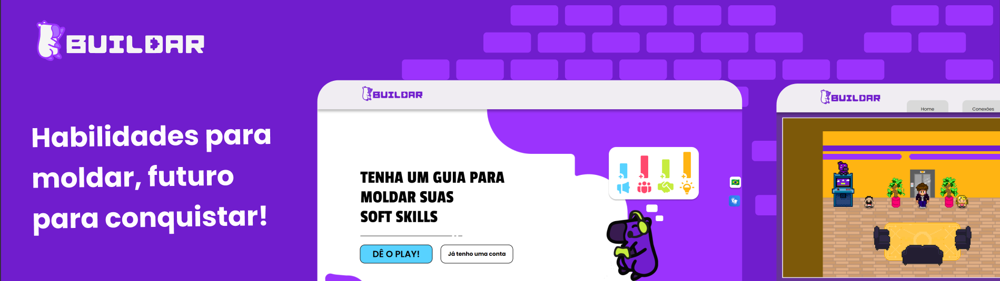

## [!;Meu+nome+é+Christian+e+sou+Desenvolvedor;>)](https://git.io/typing-svg)

### Sobre mim

<!--  -->

- 🐻 Meu apelido é _Bearly_.

- 🌱 Atualmente aprendendo sobre **Java e Spring**.

- 📘 Ex-aluno do Instituto Proa.

- 🎓 Formado como **Tecnólogo em Jogos Digitais** na UNINOVE.

- 🚀 Cursando **Bacharelado em Tecnologia da Informação** na Univesp.

- 🥇 **_[Buildar](https://github.com/Projeto-Buildar)_** - _Projeto Demoday_ - Instituto Proa.

<!-- ## Github Stats

  
  

 -->

## Habilidades técnicas

 
  

    
    
    
    
    
    
    
    
    
    
    
    
     
    
    
           
    
  

  

    
    
    
    
    
    
    
    
     
  

## Principais Projetos

<!-- 

  
  

  

 -->

  <table>
    <tr>
      <td width="420" align="center" valign="top">
        <h3>Buildar</h3>
        
      

        Plataforma web gameficada que leva o desenvolvimento de soft skills para o próximo nível. 
      

      </td>
      <td width="420" align="center" valign="top">
        <h3>Guardiões da terra</h3>
         
        

          Jogo educativo desenvolvido no Hackathon LAB do Cinema Nosso, com foco na conscientização ambiental. 
        
 
      </td>
    </tr>
  </table>

 
  
  
  
  
  

  

## Contatos

